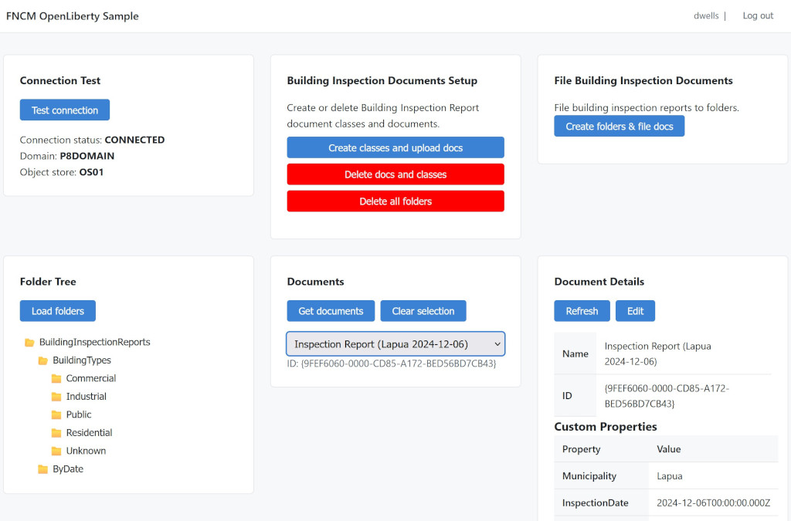
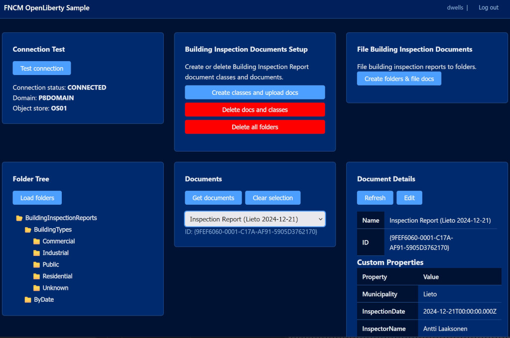
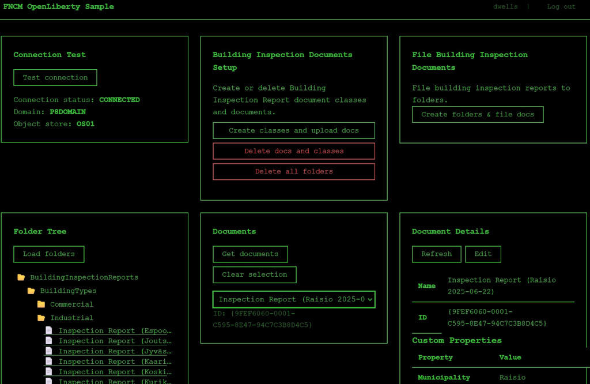

# FNCM OpenLiberty Sample

A sample web application for integrating with **IBM FileNet Content Manager (FNCM)** running on **IBM Cloud Pak for Business Automation (CP4BA)**. The app demonstrates how to build a Jakarta EE application on OpenLiberty that talks to CP4BA through both the native Java API (JACE) and the Content Services GraphQL API.

Use it as a learning reference, a starting point for your own FNCM integration, or to explore the CP4BA APIs interactively through the built-in GraphQL editor and document management UI.

---

## Prerequisites

| Requirement | Version |
|---|---|
| Java (JDK) | 21+ |
| Apache Maven | 3.9+ |
| Docker | Any recent version |
| CP4BA instance | With FileNet Content Manager deployed |
| FileNet Client JARs | `Jace.jar` and `p8cel10n.jar` (see below) |

---

## Getting the FileNet JARs

The FileNet Java Client API (JACE) is not in Maven Central. Download the JARs from your CP4BA instance:

1. Open the **FileNet Administration Console for Content Engine (ACCE)**.
2. Navigate to **<DOMAIN> → Client API Download → Java CEWS Client**.
3. Download `Jace.jar` and `p8cel10n.jar`.
4. Place both files in the `lib/` directory of this repository.

---

## Build & Run — Local

### 1. Install the FileNet JARs into your local Maven repository

```bash
mvn install:install-file -Dfile=lib/Jace.jar \
    -DgroupId=com.ibm.filenet -DartifactId=Jace \
    -Dversion=5.5 -Dpackaging=jar

mvn install:install-file -Dfile=lib/p8cel10n.jar \
    -DgroupId=com.ibm.filenet -DartifactId=p8cel10n \
    -Dversion=5.5 -Dpackaging=jar
```

### 2. Set environment variables

Copy `config.env.sample` to `config.env` and fill in your CP4BA URLs and credentials:

```bash
cp config.env.sample config.env
# edit config.env with your values
```

### 3. Build and run

```bash
mvn package
mvn liberty:run
```

The application starts on **http://localhost:9080**.

> OpenLiberty also starts an HTTPS listener on port 9443 with a self-signed certificate generated for development.

---

## Build & Run — Container

The Dockerfile installs the FileNet JARs and builds the WAR automatically. Place `Jace.jar` and `p8cel10n.jar` in `lib/` before building.

### Build the image

```bash
docker build -t fncm-openliberty-sample .
```

### Run the container

```bash
docker run --rm -p 9080:9080 --env-file config.env fncm-openliberty-sample
```

Open **http://localhost:9080** in a browser.

To use HTTPS:

```bash
docker run --rm -p 9443:9443 --env-file config.env fncm-openliberty-sample
```

---

## Environment Variables

Create a `config.env` file based on `config.env.sample`. All variables are required unless marked optional.

| Variable | Description | Required |
|---|---|---|
| `FILENET_IAMHOST` | IAM (identity provider) host. On CP4BA < 25.0.1 this is the `cp-console` host. On CP4BA 25.0.1+ it is the same as `FILENET_CP4BAHOST`. | ✅ |
| `FILENET_CP4BAHOST` | CP4BA platform host (e.g. `https://cpd-cp4ba.example.com`). | ✅ |
| `FILENET_URL` | Content Platform Engine WSI endpoint (e.g. `https://…/cpe/wsi/FNCEWS40MTOM/`). | ✅ |
| `FILENET_GRAPHQL_URL` | Content Services GraphQL API URL (e.g. `https://…/content-services-graphql/graphql`). | ✅ |
| `FILENET_DOMAIN` | FileNet P8 domain name (e.g. `P8DOMAIN`). | ✅ |
| `FILENET_OBJECTSTORE` | Object store symbolic name (e.g. `OS1`). | ✅ |
| `FILENET_STANZA` | JACE login stanza name. Default: `FileNetP8WSI`. | Optional |
| `TLS_CERTIFICATE_VERIFICATION_ENABLED` | Set to `true` to enforce TLS certificate validation. Default: `false` (trust-all, for development only). | Optional |
| `DEV_USER_NAME` | Pre-fills the login form username for development convenience. | Optional |
| `DEV_USER_PASSWORD` | Pre-fills the login form password for development convenience. | Optional |

> **Security note**: `TLS_CERTIFICATE_VERIFICATION_ENABLED=false` disables TLS certificate checks and should never be used in production.

---

## Project Structure

```
fncm-openliberty-sample/
├── src/main/
│   ├── java/dev/fncm/       ← Java backend (resources, services, operations, models)
│   ├── liberty/config/      ← OpenLiberty server.xml
│   ├── resources/           ← MicroProfile config, sample documents
│   └── webapp/              ← Frontend SPA (HTML, JS modules, CSS)
├── lib/                     ← FileNet JARs (not in version control — add manually)
├── scaffold/                ← Scaffolding templates and CSS theme backups
├── samples/                 ← GraphQL samples, shell scripts
├── scaffold.sh              ← Developer artifact generator
├── Dockerfile               ← Multi-stage container build
├── pom.xml                  ← Maven build descriptor
└── config.env.sample        ← Environment variable template
```

---

## Documentation

Full documentation lives in the [`docs/`](docs/) directory:

| Document | Description |
|---|---|
| [Architecture](docs/architecture.md) | System overview, component diagram, technology stack |
| [Authentication](docs/authentication.md) | CP4BA two-step token flow, BearerTokenFilter, TokenCache |
| [Frontend](docs/frontend.md) | SPA card system, session management, API module |
| [Backend](docs/backend.md) | Vertical-slice pattern, REST API reference, error handling |
| [GraphQL](docs/graphql.md) | GraphQL proxy, typed operations, sample query reference |
| [Adding Features](docs/adding-features.md) | scaffold.sh walkthrough and manual step-by-step guide |
| [Adding GraphQL Operations](docs/adding-graphql-operations.md) | How to add a typed Java GraphQL operation |
| [Configuration](docs/configuration.md) | All environment variables and MicroProfile Config keys |
| [Building Inspection Sample](docs/building-inspection-sample.md) | Domain example walkthrough (patterns in practice) |

---

## Quick Links

- [`config.env.sample`](config.env.sample) — environment variable template
- [`lib/README.md`](lib/README.md) — how to obtain the FileNet JARs
- [`scaffold/README.md`](scaffold/README.md) — scaffolding directory layout
- [`samples/samples.graphql`](samples/samples.graphql) — GraphQL query examples

## Images


*Default CSS*


*Navy CSS*


*Terminal CSS*