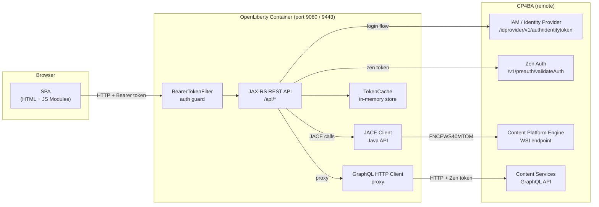
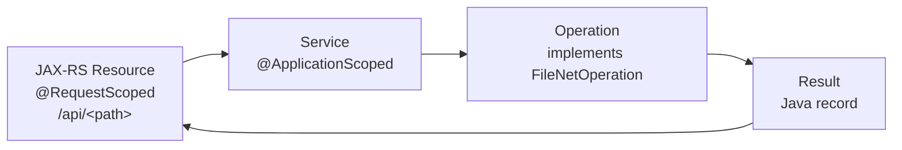
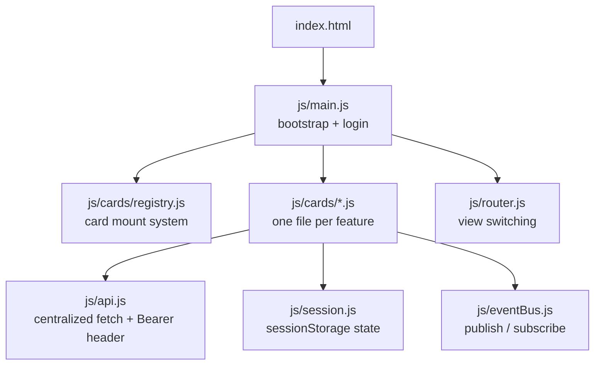

# Architecture

This document gives a bird's-eye view of the FNCM OpenLiberty Sample: what it is, how its parts fit together, and why the design is the way it is. Read this first before diving into the more detailed documents.

---

## What the Application Does

The application is a web-based integration layer between a browser and an **IBM FileNet Content Manager (FNCM)** system running inside **IBM Cloud Pak for Business Automation (CP4BA)**. It lets a logged-in user list folders and documents, view document details, check documents in and out, upload content, and run arbitrary GraphQL queries against the Content Services API — all without any desktop software beyond a browser.

---

## Component Overview



The browser talks exclusively to the OpenLiberty instance. OpenLiberty holds two distinct channels to CP4BA:

- **JACE (Java API)** — A thick client library that connects directly to the Content Platform Engine (CPE) over a MTOM/SOAP WSI endpoint. File operations, document creation, checkin/checkout, and folder management are done this way.
- **GraphQL proxy** — OpenLiberty forwards GraphQL requests from the browser to the CP4BA Content Services GraphQL API over HTTP, injecting the user's Zen token automatically.

---

## Technology Stack

| Layer | Technology | Version |
|---|---|---|
| Runtime | OpenLiberty | latest (full-java21-openj9-ubi-minimal) |
| Language | Java | 21 |
| Web framework | Jakarta EE 10 (JAX-RS, CDI, Servlet) | 10.0 |
| Configuration | MicroProfile Config | 3.1 |
| FileNet Java API | IBM JACE (Jace.jar) | 5.5 |
| Build | Apache Maven | 3.9 |
| Container | Docker (multi-stage) | — |
| Frontend | Vanilla JavaScript (ES6 modules) | — |
| Serialization | Eclipse JSON-B, Gson | — |

---

## Two API Channels

Understanding the two channels is key to reading any of the backend code.

### JACE (Java API)

JACE is IBM's Java client library for the Content Platform Engine. It provides a rich object model for documents, folders, object stores, and more. The application uses it for operations that need low-level control:

- Listing folders and document classes
- Creating documents with content and metadata
- Checking documents in and out
- Downloading content elements
- Updating content elements

The application authenticates to JACE using `OpenTokenCredentials`, which wraps the user's username and Zen token. Every JACE operation runs inside a `Subject.doAs()` call so that all FileNet access happens under the correct user identity.

### GraphQL Proxy

The CP4BA Content Services API also exposes a GraphQL endpoint. This is a modern HTTP API that accepts GraphQL queries and mutations. The application uses it in two ways:

1. **Proxy** — The browser sends a GraphQL query to `/api/graphql`; OpenLiberty injects the Zen token and forwards the request to `FILENET_GRAPHQL_URL`. This is the simplest path — no Java code needed for new queries.
2. **Typed Java operations** — For server-side logic that needs to parse GraphQL results (e.g. to feed data to another operation), the application has typed `GraphQLOperation` implementations in `service/graphql/`.

When you need to expose a new query to the frontend, the GraphQL proxy is usually the right choice. Use typed Java operations only when the server needs to process the response.

---

## Layered Architecture

The backend follows a strict vertical-slice layout: each feature owns exactly four layers.



| Layer | Role |
|---|---|
| **Resource** | Receives the HTTP request, extracts parameters, calls the service, serializes the result to JSON. |
| **Service** | Holds the CDI-injected collaborators and orchestrates the operation call against FileNet. |
| **Operation** | Contains the actual FileNet/GraphQL logic for one specific feature. Keeps concerns isolated. |
| **Result** | A plain Java record returned by the operation. Serialized automatically to JSON by JSON-B. |

This structure means every feature is self-contained. Adding a new feature adds exactly four files (or fewer for GraphQL-only features).

---

## Frontend Architecture

The frontend is a single-page application (SPA) built with plain ES6 modules — no bundler, no framework. The browser loads `index.html`, which bootstraps the module graph at runtime.

The UI is organized around **cards**: self-contained UI components that register themselves at module load time. Each card declares its HTML, initializes its DOM event handlers, and calls the REST API to display its data.



Cards communicate with each other through [`eventBus.js`](../src/main/webapp/js/eventBus.js) — a lightweight pub/sub bus. A card that produces data publishes a topic; any card that cares about that data subscribes to it. Neither side holds a reference to the other, so cards can be added, removed, or reordered without touching any other card. See [Frontend → eventBus.js](frontend.md#eventbusjs--inter-card-communication) for the full API and topic registry.

See [Frontend](frontend.md) for the full details.

---

## Authentication Summary

Login requires a two-step exchange with CP4BA: the application first obtains an IAM token, then exchanges it for a Zen token. The Zen token is stored server-side in an in-memory `TokenCache` and returned to the browser as an opaque `appToken`. Every subsequent API call carries this token in the `Authorization: Bearer` header.

See [Authentication](authentication.md) for the full token flow.

---

## Directory Structure

```
fncm-openliberty-sample/
│
├── src/main/
│   ├── java/dev/fncm/
│   │   ├── auth/                   ← BearerTokenFilter, TokenCache, TokenContext
│   │   ├── model/                  ← Java records (API result types)
│   │   ├── resource/               ← JAX-RS endpoints (one file per feature)
│   │   ├── service/
│   │   │   ├── graphql/            ← Typed GraphQL operation classes
│   │   │   └── javaapi/
│   │   │       ├── service/        ← JACE operation classes (one per feature)
│   │   │       └── buildinginspectiondocs/  ← domain-specific operations
│   │   └── utils/                  ← TLS helper, dev utilities
│   │
│   ├── liberty/config/
│   │   └── server.xml              ← OpenLiberty feature list and port config
│   │
│   ├── resources/
│   │   ├── META-INF/
│   │   │   └── microprofile-config.properties  ← config key defaults
│   │   └── building_inspection_sample_docs/    ← sample Markdown documents
│   │
│   └── webapp/
│       ├── index.html              ← SPA shell (login + app views)
│       ├── js/
│       │   ├── main.js             ← module bootstrap
│       │   ├── api.js              ← fetch wrapper, Bearer header injection
│       │   ├── session.js          ← sessionStorage state
│       │   ├── router.js           ← view switching
│       │   ├── util.js             ← DOM helpers, JSON tree viewer
│       │   ├── cards/              ← one JS file per UI feature
│       │   └── components/         ← web components (app-header)
│       └── css/                    ← token-based design system
│
├── scaffold/
│   ├── templates/
│   │   ├── css/                    ← CSS themes (default, frost, navy, paper, terminal)
│   │   ├── card/                   ← JS card template
│   │   └── java/                   ← Java slice templates (Resource, Model, Service, Operation)
│   └── backups/                    ← auto-saved CSS backups before theme changes
│
├── lib/                            ← FileNet JARs (add manually — not in version control)
├── samples/                        ← GraphQL samples, shell scripts
├── scaffold.sh                     ← developer artifact generator
├── Dockerfile                      ← multi-stage container build
└── pom.xml                         ← Maven build
```

---

## Related Documents

- [Authentication](authentication.md) — how the CP4BA token flow works
- [Backend](backend.md) — REST API reference and vertical-slice pattern details
- [Frontend](frontend.md) — card system and SPA architecture
- [GraphQL](graphql.md) — GraphQL proxy and typed operations
- [Adding Features](adding-features.md) — how to add a new feature end-to-end
- [Configuration](configuration.md) — environment variables and config keys
