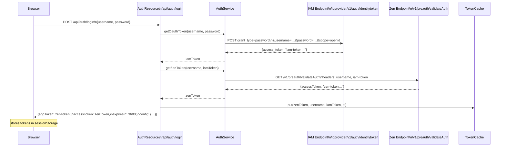

# Authentication

This document explains how authentication works in the FNCM OpenLiberty Sample end-to-end: from the browser login form through the two-step CP4BA token exchange, to how every subsequent API request is validated.

---

## Overview

CP4BA uses a two-step token flow to authenticate users:

1. **IAM token** — Obtain a short-lived identity token from the IAM (Identity and Access Management) provider by presenting a username and password.
2. **Zen token** — Exchange the IAM token for a CP4BA-specific access token (called a "Zen token") that can be used to call CP4BA services.

The application performs both steps on the server side when the user logs in, stores the resulting Zen token in a server-side cache, and returns it to the browser as an opaque `appToken`. Every subsequent call from the browser carries this token in an `Authorization: Bearer` header.

---

## Login Flow — Sequence Diagram



---

## Step 1 — IAM Token

The IAM token is obtained by posting user credentials to the IAM identity provider.

**Class**: [`AuthService.getOauthToken()`](../src/main/java/dev/fncm/service/AuthService.java)

| Detail | Value |
|---|---|
| Method | `POST` |
| URL | `{FILENET_IAMHOST}/idprovider/v1/auth/identitytoken` |
| Content-Type | `application/x-www-form-urlencoded` |
| Body | `grant_type=password&username=…&password=…&scope=openid` |
| Response field used | `access_token` |

> **CP4BA version note**: Before CP4BA 25.0.1 the IAM host (`FILENET_IAMHOST`) was a separate `cp-console.…` hostname. From CP4BA 25.0.1 onward it is the same host as `FILENET_CP4BAHOST`. See [Configuration](configuration.md) for details.

---

## Step 2 — Zen Token

The Zen token is obtained by presenting the IAM token to the CP4BA platform's pre-auth endpoint.

**Class**: [`AuthService.getZenToken()`](../src/main/java/dev/fncm/service/AuthService.java)

| Detail | Value |
|---|---|
| Method | `GET` |
| URL | `{FILENET_CP4BAHOST}/v1/preauth/validateAuth` |
| Request headers | `username: <username>`, `iam-token: <iam-token>` |
| Response field used | `accessToken` |

The Zen token is the primary credential used throughout the rest of the session. It is passed in `Authorization: Bearer` headers for all subsequent REST calls, and also used directly when the GraphQL proxy forwards queries to CP4BA.

---

## Token Storage — TokenCache

After a successful login the Zen token is stored in the server-side [`TokenCache`](../src/main/java/dev/fncm/auth/TokenCache.java).

**Class**: `TokenCache` (`@ApplicationScoped` CDI bean)

The cache maps each Zen token to:
- The **username** of the authenticated user
- The **IAM token** (needed to inject into certain downstream calls)
- An **expiry instant** (`Instant.now() + ttlSeconds`)

| Property | Detail |
|---|---|
| Implementation | `ConcurrentHashMap<String, Entry>` |
| TTL | Configurable via `token.ttl.seconds` (default: `3600` seconds) |
| Lazy eviction | Expired entries are removed on the first `get` attempt after expiry |
| Background sweep | A daemon thread sweeps the cache every `max(ttl/2, 60)` seconds |
| Logout | `TokenCache.remove(zenToken)` is called when the browser logs out |
| Persistence | **In-memory only** — all sessions are lost if the server restarts or the container is replaced |

> **Multi-instance note**: The in-memory cache means all requests for a given user must reach the same container instance. For horizontally-scaled deployments, replace `TokenCache` with a shared distributed cache (e.g. Redis).

---

## Request Authentication — BearerTokenFilter

Every request to `/api/*` (except the public paths listed below) is checked by [`BearerTokenFilter`](../src/main/java/dev/fncm/auth/BearerTokenFilter.java).

**Class**: `BearerTokenFilter` (JAX-RS `@Provider`, `ContainerRequestFilter`)

**Flow for a normal authenticated request**:

1. Extract the `Authorization` header.
2. Confirm it starts with `Bearer `.
3. Extract the token string.
4. Call `tokenCache.getUsername(token)`.
5. If the username is found: populate `TokenContext` and continue.
6. If the token is absent or expired: abort the request with `HTTP 401 {"error": "…"}`.

**Public paths** (bypass the filter without a token):

| Path pattern | Endpoint |
|---|---|
| `/api/auth/*` | Login endpoint |
| `/api/config` | Dev convenience config (username/password pre-fill) |

> The filter does **not** send a `WWW-Authenticate` response header, so browsers do not show a native login dialog. The frontend handles 401 responses by redirecting to the login view.

---

## TokenContext — Per-Request Injection

[`TokenContext`](../src/main/java/dev/fncm/auth/TokenContext.java) is a `@RequestScoped` CDI bean. After `BearerTokenFilter` validates a request, it calls:

```java
tokenContext.set(zenToken, iamToken, username);
```

Any JAX-RS resource can then inject `TokenContext` and read the user's identity and tokens:

```java
@Inject
TokenContext tokenContext;

String username  = tokenContext.getUsername();
String zenToken  = tokenContext.getZenToken();
String iamToken  = tokenContext.getIAMToken();  // may be null for some code paths
```

This is how all resource classes know who is making the request without touching HTTP headers directly.

---

## JACE Authentication

When a backend operation uses the JACE Java API to connect to the Content Platform Engine, it authenticates using the user's Zen token rather than a separate password exchange.

**Class**: [`FileNetService`](../src/main/java/dev/fncm/service/javaapi/FileNetService.java)

The pattern uses `OpenTokenCredentials`, which is JACE's mechanism for authenticating with a pre-obtained token:

```java
OpenTokenCredentials credentials = new OpenTokenCredentials(username, zenToken, null);
Subject subject = credentials.doAs(connection, () -> {
    // all JACE operations run inside this closure under the user's identity
    return operation.execute(connection, config);
});
```

This means JACE enforces the same user permissions as the CP4BA security model — users cannot access documents or folders they do not have rights to, regardless of how the request was made.

---

## Dev Convenience — Pre-filling the Login Form

Setting `DEV_USER_NAME` and `DEV_USER_PASSWORD` environment variables instructs the server to return those credentials via the public `GET /api/config` endpoint. The browser reads this endpoint on startup and pre-fills the login form fields.

This is for development environments only. Do not set these variables in production — they expose plaintext credentials over an unprotected endpoint.

---

## Related Documents

- [Configuration](configuration.md) — `FILENET_IAMHOST`, `FILENET_CP4BAHOST`, `token.ttl.seconds`, `DEV_USER_NAME/PASSWORD`
- [Backend](backend.md) — `BaseResource`, `TokenContext` injection pattern
- [Architecture](architecture.md) — overall system context
