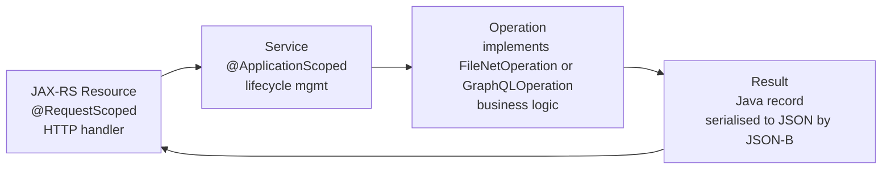

# Backend

This document describes the backend architecture of the FNCM OpenLiberty Sample: the vertical-slice pattern, every REST endpoint, the base classes that make endpoints concise, and how the JACE and GraphQL service layers work.

---

## Overview

The backend is a Jakarta EE 10 application running on OpenLiberty. The REST API is mounted at `/api` and served by JAX-RS (`restfulWS-3.1`). Dependency injection is CDI (`cdi-4.0`). Configuration is MicroProfile Config (`mpConfig-3.1`).

Every feature follows the same four-layer **vertical-slice pattern**: a JAX-RS Resource delegates to a Service, which runs an Operation against FileNet, and the Operation returns a typed Result record.

---

## Vertical-Slice Pattern



Each feature owns exactly these four artifacts:

| Layer | Package | Naming | Responsibility |
|---|---|---|---|
| Resource | `resource/` | `{Name}Resource.java` | JAX-RS path, HTTP method, deserialize params, call service, serialize result |
| Service | `service/` or injected directly | `{Name}Service.java` | CDI-managed, injects collaborators, calls operation |
| Operation | `service/javaapi/service/` | `{Name}Operation.java` | Implements `FileNetOperation<T>`; contains the JACE logic for one feature |
| Result | `model/` | `{Name}Result.java` | Java record; auto-serialized to JSON by JSON-B |

**Worked example — Connection Test**:

```java
// Resource: HTTP boundary
@Path("/connectiontest")
@RequestScoped
public class ConnectionTestResource extends BaseResource {
    @Inject FileNetService fileNetService;

    @GET
    public Response connectionTest() {
        return execute(() -> fileNetService.run(new ConnectionTestOperation(), tokenContext));
    }
}

// Operation: FileNet logic
public class ConnectionTestOperation implements FileNetOperation<ConnectionTestResult> {
    @Override
    public ConnectionTestResult execute(ObjectStore os, String username) {
        String domain = os.get_Domain().get_Name();
        String storeName = os.get_DisplayName();
        return new ConnectionTestResult("CONNECTED", domain, storeName, username);
    }
}

// Result: auto-serialized to JSON
public record ConnectionTestResult(String status, String domain, String objectStore, String username) {}
```

---

## REST Endpoint Reference

All endpoints are under `/api`. Endpoints marked **Auth required** need a valid `Authorization: Bearer` token (checked by `BearerTokenFilter`).

| Method | Path | Auth | Description |
|---|---|---|---|
| `POST` | `/api/auth/login` | — | Exchange username/password for a CP4BA Zen token. Returns `appToken`, `accessToken`, `expiresIn`, `config`. |
| `GET` | `/api/config` | — | Returns dev convenience config (`devUsername`, `devPassword` if set). Not for production. |
| `GET` | `/api/connectiontest` | ✅ | Verifies JACE connectivity; returns domain name, object store name, and username. |
| `POST` | `/api/graphql` | ✅ | Proxy: forwards a GraphQL request body to the CP4BA Content Services GraphQL API. |
| `GET` | `/api/listfolders` | ✅ | Lists top-level folders in the configured object store. |
| `GET` | `/api/listdocumentclasses` | ✅ | Lists document class names in the configured object store. |
| `GET` | `/api/documents` | ✅ | Returns username and a stub message; example of the minimal resource pattern. |
| `GET` | `/api/listdocumentsinfolder` | ✅ | Lists documents in a folder path (query param `folderPath`). |
| `GET` | `/api/getusergroups` | ✅ | Returns the current user's security groups via the GraphQL API. |
| `GET` | `/api/buildinginspectiondocs` | ✅ | Lists building inspection documents. |
| `POST` | `/api/buildinginspectiondocs` | ✅ | Adds building inspection documents (creates document structure). |
| `GET` | `/api/filebuildinginspectiondocs` | ✅ | Lists file-backed building inspection documents. |
| `POST` | `/api/filebuildinginspectiondocs` | ✅ | Uploads building inspection documents from resource files. |
| `POST` | `/api/createbuildinginspectionreportdocument` | ✅ | Creates a typed `BuildingInspectionReport` document with metadata and content. |
| `POST` | `/api/checkindocument` | ✅ | Checks in a previously checked-out document. |
| `GET` | `/api/downloaddocument` | ✅ | Downloads the content of a document content element as a binary stream. |
| `PUT` | `/api/contentElement` | ✅ | Replaces or adds a content element on an existing document. |
| `DELETE` | `/api/deleteallfolders` | ✅ | Deletes all folders in the object store (dev/reset utility). |

---

## BaseResource

[`BaseResource`](../src/main/java/dev/fncm/resource/BaseResource.java) is the abstract base class for all resource classes. It provides:

### Injected Fields

```java
@Inject protected TokenContext tokenContext;  // current user's tokens and username
@Inject protected TokenCache   tokenCache;    // server-side token store
```

### execute(action)

The standard way to call a service. Wraps the action in uniform error handling:

```java
return execute(() -> fileNetService.run(new MyOperation(), tokenContext));
```

| Exception type | HTTP Status |
|---|---|
| `IllegalStateException` | `503 Service Unavailable` |
| Any other `Exception` | `500 Internal Server Error` |
| No exception | `200 OK` with the result body serialized to JSON |

### executeResponse(action)

Variant for operations that produce a `Response` directly (e.g. streaming downloads). The response is returned as-is rather than wrapped in a new `200 OK`.

```java
return executeResponse(() -> {
    byte[] bytes = fileNetService.run(new DownloadContentElementOperation(…), tokenContext);
    return Response.ok(bytes).header("Content-Type", contentType).build();
});
```

### error(status, message)

Builds a uniform error response:

```java
return error(400, "folderPath is required");
// → HTTP 400 {"error": "folderPath is required"}
```

---

## FileNetService

[`FileNetService`](../src/main/java/dev/fncm/service/javaapi/FileNetService.java) is the single gateway to the JACE Java API. Resource classes inject it and call `run(operation, tokenContext)` — they never interact with JACE directly.

### What run() Does

1. Reads `username` and `zenToken` from `TokenContext`.
2. Configures SSL (trust-all in dev when `TLS_CERTIFICATE_VERIFICATION_ENABLED=false`).
3. Creates `OpenTokenCredentials(username, zenToken, null)` — JACE's token-based auth.
4. Calls `credentials.doAs()`, which sets up a JAAS security context.
5. Inside `doAs`: creates a `Connection`, fetches the `Domain`, fetches the `ObjectStore`.
6. Calls `operation.execute(objectStore, username)`.
7. Returns the typed result.

### FileNetOperation Interface

```java
public interface FileNetOperation<T> {
    T execute(ObjectStore os, String username) throws Exception;
}
```

Implement this interface for each new JACE-based feature. The operation receives a ready-to-use, fully-authenticated `ObjectStore` — no auth or connection management needed inside the implementation.

---

## GraphQLService

[`GraphQLService`](../src/main/java/dev/fncm/service/GraphQLService.java) is the gateway to the Content Services GraphQL API. It mirrors `FileNetService`'s plug-in shape.

### Methods

| Method | Use |
|---|---|
| `execute(GraphQLOperation, zenToken)` | Run a typed `GraphQLOperation` |
| `executeRaw(jsonBody, zenToken)` | Forward a pre-built JSON body (used by the proxy endpoint) |
| `executeMultipart(FileUploadOperation, zenToken)` | Run a file-upload mutation |

### GraphQLOperation Interface

```java
public interface GraphQLOperation {
    String query();                     // the GraphQL query/mutation string
    Map<String, Object> variables();    // optional variable bindings (empty map if none)
}
```

Implement this interface for each new server-side GraphQL operation. See [Adding GraphQL Operations](adding-graphql-operations.md) for a step-by-step guide.

---

## CDI Scopes

| Scope | Used on | Lifetime |
|---|---|---|
| `@ApplicationScoped` | `FileNetService`, `GraphQLService`, `AuthService`, `TokenCache`, `GraphQLClient`, `FileNetConfig` | One instance for the server's lifetime |
| `@RequestScoped` | All `Resource` classes, `TokenContext` | One instance per HTTP request; destroyed after the response is sent |

`TokenContext` must be `@RequestScoped` because it holds per-request authentication data. `FileNetService` is `@ApplicationScoped` because it is stateless — it creates a new connection per `run()` call rather than pooling.

---

## Error Response Contract

All error responses from any endpoint have the same JSON shape:

```json
{ "error": "human-readable message" }
```

HTTP status codes used:

| Code | Meaning |
|---|---|
| `200` | Success |
| `400` | Invalid request (missing or bad parameters) |
| `401` | Missing, expired, or unrecognized Bearer token |
| `500` | Unexpected server error (check server logs) |
| `503` | Configuration error or FileNet connection unavailable |

The frontend checks `res.ok` and parses `err.error` from the JSON body to display error messages in cards.

---

## Configuration Injection

Backend classes read configuration through MicroProfile Config's `@ConfigProperty` annotation:

```java
@Inject
@ConfigProperty(name = "filenet.cpe.url")
String cpeUrl;
```

MicroProfile Config reads values from environment variables (e.g. `FILENET_URL` → `filenet.cpe.url`) and from `src/main/resources/META-INF/microprofile-config.properties` for defaults. See [Configuration](configuration.md) for the full mapping.

---

## MicroProfile Config Properties

[`FileNetConfig`](../src/main/java/dev/fncm/service/javaapi/FileNetConfig.java) is the CDI bean that holds all FileNet connection settings and makes them available to services:

```java
@ApplicationScoped
public class FileNetConfig {
    @Inject @ConfigProperty(name = "filenet.cpe.url")           String url;
    @Inject @ConfigProperty(name = "filenet.domain")            String domain;
    @Inject @ConfigProperty(name = "filenet.objectstore")       String objectStore;
    @Inject @ConfigProperty(name = "filenet.stanza", defaultValue = "FileNetP8WSI") String stanza;
    // …
}
```

Services inject `FileNetConfig` rather than individual `@ConfigProperty` fields.

---

## Adding a New Endpoint

The fastest way is `./scaffold.sh --feature my-feature`, which generates all four files. For manual creation see [Adding Features](adding-features.md).

The minimal pattern for a new JACE-based endpoint:

```java
// 1. Result record (model/MyFeatureResult.java)
public record MyFeatureResult(String someField) {}

// 2. Operation (service/javaapi/service/MyFeatureOperation.java)
public class MyFeatureOperation implements FileNetOperation<MyFeatureResult> {
    @Override
    public MyFeatureResult execute(ObjectStore os, String username) throws Exception {
        // use JACE os.* methods here
        return new MyFeatureResult("value");
    }
}

// 3. Resource (resource/MyFeatureResource.java)
@Path("/myfeature")
@RequestScoped
@Produces(MediaType.APPLICATION_JSON)
public class MyFeatureResource extends BaseResource {
    @Inject FileNetService fileNetService;

    @GET
    public Response get() {
        return execute(() -> fileNetService.run(new MyFeatureOperation(), tokenContext));
    }
}
```

---

## Related Documents

- [Authentication](authentication.md) — TokenContext, BearerTokenFilter
- [GraphQL](graphql.md) — GraphQL proxy and typed operations
- [Adding Features](adding-features.md) — scaffold.sh walkthrough
- [Adding GraphQL Operations](adding-graphql-operations.md) — step-by-step guide
- [Configuration](configuration.md) — all config keys
