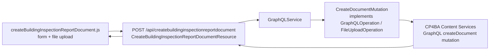
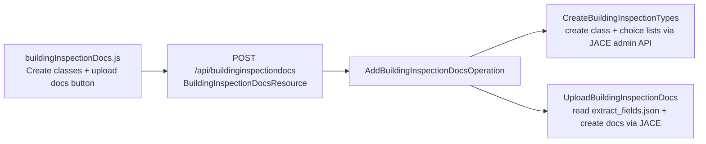
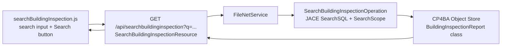

# Building Inspection Sample

This document describes the Building Inspection domain — a concrete, end-to-end example built into the application that demonstrates all the major patterns described in the other documentation. Reading this alongside [Backend](backend.md) and [Adding Features](adding-features.md) shows exactly how the patterns look in practice.

---

## What Is the Building Inspection Sample?

The building inspection domain models a **municipal building inspection workflow**. Inspectors examine buildings and record their findings as formal documents. Each document has:

- Structured metadata describing the inspection (who, when, where, what type of building, compliance outcome).
- An optional file attachment — the actual inspection report text (Markdown format in the sample data).

The application includes:
- A custom FileNet document class (`BuildingInspectionReport`) with 6 domain-specific properties.
- 16 sample inspection reports as Markdown files, ready to be uploaded to CP4BA.
- Four UI cards for managing and searching this data.
- A full set of Java backend classes demonstrating JACE class creation, document upload, GraphQL-based document creation, and full-text metadata search.

---

## Document Class

In FileNet, documents are organized by **document class** — a schema that defines what metadata properties a document has. The building inspection class is defined with these custom properties:

| Property Name (symbolic) | Display Name | Type | Values |
|---|---|---|---|
| `Municipality` | Municipality | String | Free text |
| `PropertyAddress` | Property Address | String | Free text |
| `InspectorName` | Inspector Name | String | Free text |
| `InspectionDate` | Inspection Date | DateTime | Date value |
| `BuildingType` | Building Type | String (choice list) | Industrial, Residential, Public, Commercial, Unknown |
| `ComplianceStatus` | Compliance Status | String (choice list) | Fully Compliant, Mostly Compliant, Partially Compliant, Non-Compliant, Requires Follow-up, Unknown |

All constants (symbolic names, class name, root folder name, choice list names) are centralized in [`BuildingInspectionConstants`](../src/main/java/dev/fncm/service/javaapi/service/buildinginspectiondocs/BuildingInspectionConstants.java).

**Class symbolic name**: `BuildingInspectionReport`  
**Root folder**: `BuildingInspectionReports`

---

## Folder Structure

When sample documents are uploaded, the backend creates this folder hierarchy in the object store:

```
/BuildingInspectionReports/
  ByDate/
    2024/
      10/
      11/
      12/
    2025/
      01/
      03/
      …
```

Documents are filed by inspection date so queries like "all inspections in April 2025" can use folder-based filtering.

---

## Sample Data

16 sample inspection reports are included in the application as Markdown files at [`src/main/resources/building_inspection_sample_docs/building_inspections/`](../src/main/resources/building_inspection_sample_docs/building_inspections/). Each file is a realistic building inspection report generated with different LLMs (deepseek, granite, llama, mistral variants).

The companion file [`extract_fields.json`](../src/main/resources/building_inspection_sample_docs/extract_fields.json) maps each file to its extracted metadata — municipality, address, inspector name, date, building type, and compliance status. This is used by `FileBuildingInspectionDocsOperation` to set the correct properties when uploading.

---

## Backend — Operations Map

The building inspection module has the most complex backend in the application, with 11 classes in `service/javaapi/service/buildinginspectiondocs/`:

| Class | What it does |
|---|---|
| [`BuildingInspectionConstants`](../src/main/java/dev/fncm/service/javaapi/service/buildinginspectiondocs/BuildingInspectionConstants.java) | Shared string constants (class name, property names, folder name) |
| [`CreateBuildingInspectionTypes`](../src/main/java/dev/fncm/service/javaapi/service/buildinginspectiondocs/CreateBuildingInspectionTypes.java) | Creates the `BuildingInspectionReport` document class and its properties via JACE admin API |
| [`AddBuildingInspectionDocsOperation`](../src/main/java/dev/fncm/service/javaapi/service/buildinginspectiondocs/AddBuildingInspectionDocsOperation.java) | Orchestrates class creation and bulk document upload |
| [`UploadBuildingInspectionDocs`](../src/main/java/dev/fncm/service/javaapi/service/buildinginspectiondocs/UploadBuildingInspectionDocs.java) | Reads `extract_fields.json` and creates documents without file content (metadata only) |
| [`FileBuildingInspectionDocsOperation`](../src/main/java/dev/fncm/service/javaapi/service/buildinginspectiondocs/FileBuildingInspectionDocsOperation.java) | Reads Markdown files from resources and uploads them with metadata |
| [`CreateFoldersAndFileBuildingInspectionReports`](../src/main/java/dev/fncm/service/javaapi/service/buildinginspectiondocs/CreateFoldersAndFileBuildingInspectionReports.java) | Creates the date-based folder tree and files documents into it |
| [`CreateBuildingInspectionDocumentOperation`](../src/main/java/dev/fncm/service/javaapi/service/buildinginspectiondocs/CreateBuildingInspectionDocumentOperation.java) | Scaffold for a JACE-based single document create (placeholder — actual creation uses GraphQL) |
| [`DeleteBuildingInspectionDocsOperation`](../src/main/java/dev/fncm/service/javaapi/service/buildinginspectiondocs/DeleteBuildingInspectionDocsOperation.java) | Deletes all `BuildingInspectionReport` documents and the document class |
| [`DeleteBuildingInspectionTypes`](../src/main/java/dev/fncm/service/javaapi/service/buildinginspectiondocs/DeleteBuildingInspectionTypes.java) | Deletes choice lists and property definitions |
| [`FileNetQueryUtil`](../src/main/java/dev/fncm/service/javaapi/service/buildinginspectiondocs/FileNetQueryUtil.java) | Shared JACE query helpers (find templates by symbolic name, SQL escape) |
| [`SearchBuildingInspectionOperation`](../src/main/java/dev/fncm/service/javaapi/service/buildinginspectiondocs/SearchBuildingInspectionOperation.java) | Searches all `BuildingInspectionReport` documents whose custom metadata matches a user-supplied string via SQL `LIKE` |

---

## Vertical Slice Walkthrough

### Creating a Document via GraphQL (User-Initiated)

The **Create Building Inspection Report Document** card creates one new document at a time with user-supplied metadata and an optional file. This is the primary interactive feature and uses the **GraphQL channel** (not JACE), which is the recommended approach for document creation.

**Flow**:



**Resource** — [`CreateBuildingInspectionReportDocumentResource`](../src/main/java/dev/fncm/resource/CreateBuildingInspectionReportDocumentResource.java):

- Accepts `multipart/form-data` with 6 metadata fields plus an optional `file` part.
- Converts the `YYYY-MM-DD` date string to ISO-8601 format (`2025-04-15T00:00:00Z`).
- Builds a `CreateDocumentMutation` with the properties map and optional file bytes.
- If a file is present: calls `graphQLService.executeMultipart(mutation, zenToken)`.
- If no file: calls `graphQLService.execute(mutation, zenToken)`.

**Mutation** — [`CreateDocumentMutation`](../src/main/java/dev/fncm/service/graphql/CreateDocumentMutation.java):

Implements both `GraphQLOperation` (for the no-file path) and `FileUploadOperation` (for the with-file path). The GraphQL mutation it sends is equivalent to:

```graphql
mutation CreateDocument {
  createDocument(
    repositoryIdentifier: "OS1"
    classIdentifier: "BuildingInspectionReport"
    documentProperties: {
      name: "Inspection Report (Espoo 2025-04-15)"
      properties: [
        { Municipality: "Espoo" }
        { PropertyAddress: "Katu 42" }
        { InspectorName: "Matti Virtanen" }
        { InspectionDate: "2025-04-15T00:00:00Z" }
        { BuildingType: "Residential" }
        { ComplianceStatus: "Fully Compliant" }
      ]
    }
    checkinAction: {}
  ) {
    id
    name
  }
}
```

When a file is included, the mutation is sent as a `multipart/form-data` request with the GraphQL JSON envelope in the `graphql` part and the file bytes in the `contvar` part.

### Bulk Setup via JACE (Class Creation + Sample Upload)

The **Building Inspection Documents Setup** card (`POST /api/buildinginspectiondocs`) creates the document class and uploads all 16 sample documents in one operation. This uses the **JACE channel**.

**Flow**:



**`CreateBuildingInspectionTypes`** uses the JACE administration API to:
1. Check if `BuildingInspectionReport` already exists — skip if so.
2. Create a subclass of `Document` with symbolic name `BuildingInspectionReport`.
3. Create `PropertyTemplateString` and `PropertyTemplateDateTime` instances for each property.
4. Create `ChoiceList` instances for `BuildingType` and `ComplianceStatus`.
5. Link choice lists to properties and add all properties to the class definition.

This is a good reference for the JACE administration API. Note that admin operations require elevated permissions in CP4BA.

### File the Sample Docs (`/api/filebuildinginspectiondocs`)

The **File Building Inspection Docs** card reads the 16 Markdown files from `src/main/resources/building_inspection_sample_docs/building_inspections/`, parses `extract_fields.json` for metadata, creates the date-based folder tree, and uploads each document with its content element.

---

## Frontend Cards

The three browse-and-view cards — [`listFolders.js`](../src/main/webapp/js/cards/listFolders.js), [`listDocumentsInFolder.js`](../src/main/webapp/js/cards/listDocumentsInFolder.js), and [`documentDetails.js`](../src/main/webapp/js/cards/documentDetails.js) — communicate through [`eventBus.js`](../src/main/webapp/js/eventBus.js) without holding direct references to each other:

- `listFolders.js` publishes `TOPICS.FOLDER_SELECTED` when a folder row is clicked.
- `listDocumentsInFolder.js` subscribes to `TOPICS.FOLDER_SELECTED` and loads the folder's documents; when the user clicks a document it publishes `TOPICS.DOCUMENT_ID` and `TOPICS.DOCUMENT_SELECTED`.
- `documentDetails.js` subscribes to `TOPICS.DOCUMENT_ID` to fetch full document details, and to `TOPICS.DOCUMENT_CLEARED` to reset its display.

This means any of these cards can be hidden via `layout-config.js` without breaking the others. See [Frontend → eventBus.js](frontend.md#eventbusjs--inter-card-communication) for the full pub/sub API and topic registry.

### Building Inspection Documents Setup (`buildingInspectionDocs.js`)

**Card ID**: `addbuildinginspectiondocs`  
**Size**: normal

Three buttons:

| Button | API call | Effect |
|---|---|---|
| Create classes and upload docs | `POST /api/buildinginspectiondocs` | Creates the document class and uploads 16 sample documents |
| Delete docs and classes | `DELETE /api/buildinginspectiondocs` | Removes all `BuildingInspectionReport` documents and the class |
| Delete all folders | `DELETE /api/deleteallfolders` | Removes all folders in the object store |

This card is a simple setup/teardown tool. Each button calls `runCardAction()` which handles the spinner lifecycle and error display automatically.

### File Building Inspection Docs (`fileBuildingInspectionDocs.js`)

**Card ID**: `filebuildinginspectiondocs`  
**Size**: normal

Triggers `POST /api/filebuildinginspectiondocs` to create the folder structure and upload the Markdown files with metadata.

### Create Building Inspection Report Document (`createBuildingInspectionReportDocument.js`)

**Card ID**: `create-document`  
**Size**: wide

This is the most feature-complete card in the application. It demonstrates:

- **Dynamic form building** using `formTextField`, `formDateField`, and `formSelectField` helpers from `util.js`.
- **Inline test data generation** (`Fill test data` button populates all fields with random realistic values).
- **Three content modes**: no content element, upload a file, or write Markdown inline with a live preview editor ([markdown-text-editor](https://github.com/nezanuha/markdown-text-editor)).
- **Multipart form submission**: builds a `FormData` object and sends it as `multipart/form-data` to the backend.
- **Required-field validation** on the client side before submitting.

The card reads the choice list values from [`buildingInspectionConstants.js`](../src/main/webapp/js/cards/buildingInspectionConstants.js) to keep the frontend and backend in sync.

### Search Building Inspection Reports (`searchBuildingInspection.js`)

**Card ID**: `search-building-inspection`
**Size**: wide
**API**: `GET /api/searchbuildinginspection?q=<text>`

A single-field search card that queries all custom metadata properties of `BuildingInspectionReport` documents for a user-supplied string. Typing and pressing Enter or clicking the Search button executes the query.

**What it searches**: the five custom string properties — `Municipality`, `PropertyAddress`, `InspectorName`, `BuildingType`, and `ComplianceStatus` — using a SQL `LIKE '%<text>%'` predicate joined with `OR`. Results are ordered by `DateCreated DESC` and capped at 100.

> **Note**: FileNet SQL `LIKE` matching is case-sensitive. Search for `espoo` and `Espoo` will produce different results.

Results are displayed in a six-column table (Title, Municipality, Address, Inspector, Building Type, Compliance) with a JSON-tree toggle. Clicking a document row publishes `TOPICS.DOCUMENT_ID` and `TOPICS.DOCUMENT_SELECTED` so the `document-details` card updates automatically — the same wiring used by `listDocumentsInFolder.js`.

**Backend vertical slice**:



**Resource** — [`SearchBuildingInspectionResource`](../src/main/java/dev/fncm/resource/SearchBuildingInspectionResource.java): accepts a `q` query parameter, returns 400 if absent or blank, delegates to `SearchBuildingInspectionOperation` via `FileNetService.run()`.

**Operation** — [`SearchBuildingInspectionOperation`](../src/main/java/dev/fncm/service/javaapi/service/buildinginspectiondocs/SearchBuildingInspectionOperation.java): builds a `SearchSQL` with `LIKE` predicates across all five custom string properties, uses `FileNetQueryUtil.escapeSql()` to sanitise the input, and returns a `SearchBuildingInspectionResult` containing the matched `SearchBuildingInspectionItem` list.

**Result types**:
- [`SearchBuildingInspectionResult`](../src/main/java/dev/fncm/model/SearchBuildingInspectionResult.java) — `{ count, query, documents[] }`
- [`SearchBuildingInspectionItem`](../src/main/java/dev/fncm/model/SearchBuildingInspectionItem.java) — `{ id, documentTitle, municipality, propertyAddress, inspectorName, buildingType, complianceStatus, inspectionDate, dateCreated }`

---

## How This Relates to the Patterns

| Building Inspection artifact | Generic pattern |
|---|---|
| `BuildingInspectionReport` document class | A custom FileNet content type with domain-specific properties |
| `CreateBuildingInspectionReportDocumentResource` | JAX-RS Resource → GraphQLService (GraphQL channel) |
| `AddBuildingInspectionDocsOperation` | JAX-RS Resource → FileNetService → FileNetOperation (JACE channel) |
| `CreateBuildingInspectionTypes` | JACE admin operation (schema management) |
| `CreateDocumentMutation` | Typed GraphQL operation + FileUploadOperation |
| `buildingInspectionDocs.js` | Card with `runCardAction` + `renderJson` pattern |
| `createBuildingInspectionReportDocument.js` | Complex card with forms, validation, multipart upload |
| `BuildingInspectionConstants` | Shared constants — good practice for any domain module |
| `SearchBuildingInspectionOperation` | JACE `SearchSQL` / `SearchScope` query with `LIKE` predicates |
| `searchBuildingInspection.js` | Card with search input, table rendering, and eventBus publish |

The building inspection module is the reference implementation for a "real" feature. When in doubt about how to structure a new domain feature, use the building inspection classes as a model.

---

## Related Documents

- [Backend](backend.md) — vertical-slice pattern, FileNetService, GraphQLService
- [GraphQL](graphql.md) — `createDocument` mutation, checkout/checkin
- [Adding Features](adding-features.md) — scaffold.sh workflow
- [Adding GraphQL Operations](adding-graphql-operations.md) — typed operations, file upload
- [Frontend](frontend.md) — card system, runCardAction, form helpers
