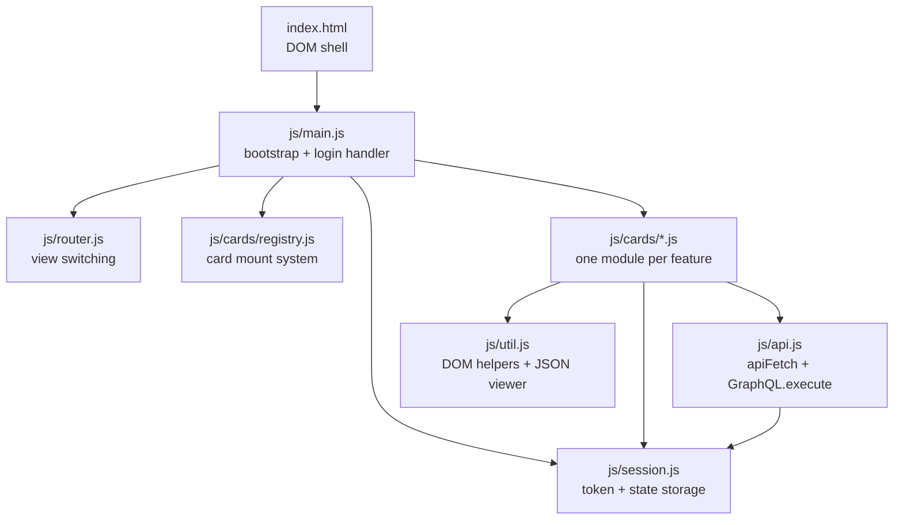

# Frontend

This document describes the frontend architecture of the FNCM OpenLiberty Sample: how the single-page application (SPA) is structured, how the card system works, how state and authentication tokens are managed, and how to call the REST and GraphQL APIs from a card.

---

## Overview

The frontend is a vanilla JavaScript SPA with no build step and no framework. The browser loads a single [`index.html`](../src/main/webapp/index.html) file, which bootstraps an ES6 module graph at runtime. All JavaScript is organized into small, purpose-specific modules.

Key design principles:

- **No bundler** — each `.js` file is a native ES6 module loaded directly by the browser.
- **No framework** — DOM manipulation uses plain `document.getElementById`, `innerHTML`, and event listeners.
- **Card-based layout** — every feature is a self-contained "card" that registers itself and adds its own HTML to the page grid.
- **Centralized fetch** — all HTTP calls go through [`api.js`](../src/main/webapp/js/api.js), which automatically attaches the Bearer token.
- **SessionStorage state** — authentication tokens and runtime state survive page reloads via `sessionStorage`.

---

## Module Map



---

## The Card System

The card system is the central UI pattern. Each feature lives in a single `.js` file under `src/main/webapp/js/cards/` and declares itself by calling [`registerCard()`](../src/main/webapp/js/cards/registry.js) at module load time.

### Card Definition Shape

```js
registerCard({
  id: 'my-feature',                // kebab-case feature slug
  size: 'normal',                  // grid size (see below)
  html: () => `<div class="card" id="card-my-feature"> … </div>`,
  init() {                         // wire up DOM event listeners
    document.getElementById('my-feature-btn').addEventListener('click', async () => {
      // call API, render result
    });
  },
  runAfterLogin: false,            // optional — auto-run on login if true
  run() { … },                     // optional — shared action for runAfterLogin + UI trigger
});
```

| Property | Type | Required | Description |
|---|---|---|---|
| `id` | string | ✅ | Kebab-case slug; should match the card wrapper's `id="card-{id}"` |
| `size` | string | No | Grid span modifier (see table below) |
| `html` | `() => string` | ✅ | Returns the card's inner HTML (called once at mount time) |
| `init` | `() => void` | ✅ | Wires up event listeners after the HTML is in the DOM |
| `runAfterLogin` | boolean | No | If `true`, `run()` is called automatically after a successful login |
| `run` | `() => void\|Promise` | No | A callable action — used by `runAfterLogin` and shared button handlers |

### Card Sizes

The card grid supports five sizes controlled by the `data-size` attribute set by `registry.js`:

| `size` value | Grid behaviour |
|---|---|
| `normal` (default) | Single column, standard height |
| `wide` | Spans two columns |
| `tall` | Double height |
| `large` | Two columns × double height |
| `full` | Spans all columns (full width) |

### Card Mount Lifecycle

1. Each card module is imported in [`main.js`](../src/main/webapp/js/main.js) (import order = display order in the grid).
2. At import time the module calls `registerCard(…)`, adding its definition to an internal array in `registry.js`.
3. On `DOMContentLoaded`, `main.js` calls `mountAllCards(gridEl)`:
   - For each registered card: creates a wrapper, sets `card.html()` as `innerHTML`, appends the element to the grid, calls `card.init()`.
4. After a successful login, `main.js` calls `runPostLoginCards()`, which calls `run()` on every card that has `runAfterLogin: true`.

### Display Order

Cards appear in the grid in the order their import lines appear in [`main.js`](../src/main/webapp/js/main.js). To reorder cards, reorder the import lines.

---

## api.js — Centralized Fetch

[`api.js`](../src/main/webapp/js/api.js) exports two things:

### API path map

The `API` object maps logical names to endpoint paths:

```js
export const API = {
  login:                  '/api/auth/login',
  graphql:                '/api/graphql',
  connectionTest:         '/api/connectiontest',
  listFolders:            '/api/listfolders',
  listDocumentClasses:    '/api/listdocumentclasses',
  userGroups:             '/api/getusergroups',
  documents:              '/api/documents',
  listDocumentsInFolder:  '/api/listdocumentsinfolder',
  // … and more
};
```

Always use the `API` map rather than hardcoding paths. When scaffold.sh generates a new feature with `--feature`, it adds the new entry to this map automatically.

### apiFetch

`apiFetch(url, options)` wraps `fetch()` and automatically injects the `Authorization: Bearer` header from `session.appToken`:

```js
export async function apiFetch(url, options = {}) {
  const headers = {
    'Authorization': 'Bearer ' + session.appToken,
    ...options.headers,
  };
  return fetch(url, { ...options, headers });
}
```

Usage in a card:

```js
const res = await apiFetch(API.listFolders);
if (!res.ok) throw new Error(`HTTP ${res.status}`);
const data = await res.json();
```

### GraphQL.execute

`GraphQL.execute(query, variables)` sends a GraphQL query through the server-side proxy at `/api/graphql`. It returns the parsed JSON response directly (no `.json()` call needed):

```js
const data = await GraphQL.execute(
  `query($repo: String!) {
     folder(repositoryIdentifier: $repo, identifier: "/") {
       subFolders { folders { name } }
     }
   }`,
  { repo: session.config.repositoryIdentifier }
);
```

If the response is a 401, `GraphQL.execute` throws an error with `err.status = 401`.

---

## session.js — State Management

[`session.js`](../src/main/webapp/js/session.js) exports a single `session` object that persists state to `sessionStorage` (survives page reloads, cleared when the browser tab is closed).

### Properties

| Property | Type | Description |
|---|---|---|
| `session.appToken` | string | The Zen token used as the Bearer token for all `/api/*` calls |
| `session.accessToken` | string | Same Zen token — available for use in direct GraphQL variables if needed |
| `session.username` | string | Logged-in username |
| `session.config` | object | Non-sensitive server config returned at login (see below) |
| `session.state` | object | Generic key-value store for card-to-card communication |

### session.config

After login the server returns a `config` object with these fields:

| Field | Description |
|---|---|
| `session.config.repositoryIdentifier` | FileNet object store symbolic name (e.g. `OS1`) |
| `session.config.domain` | FileNet P8 domain name |
| `session.config.stanza` | FileNet JACE login stanza name |

Use these values as variables in GraphQL queries and REST calls — do not hardcode them:

```js
const vars = { repositoryIdentifier: session.config.repositoryIdentifier };
```

### Runtime State

Cards can share arbitrary data through `session.state`:

```js
// Write (also persists to sessionStorage)
session.setState('selectedDocumentId', docId);

// Read
const id = session.getState('selectedDocumentId');

// Clear one key
session.clearState('selectedDocumentId');
```

This is how the `folderTree` card communicates a selected folder path to the `documentDetails` card, for example.

---

## router.js — View Switching

[`router.js`](../src/main/webapp/js/router.js) manages the two top-level views: `view-login` and `view-app`.

| Function | Effect |
|---|---|
| `enterApp()` | Shows the app view, sets the username in the header |
| `logout()` | Clears `session`, resets the form, shows the login view |
| `showView(name)` | Generic: activates the named `.view` element |

`main.js` calls `enterApp()` after a successful login and wires `logout()` to the logout button.

---

## util.js — DOM Helpers

[`util.js`](../src/main/webapp/js/util.js) exports several helpers used by cards:

### renderJson(container, data)

Renders `data` as an interactive JSON tree inside `container` with a Tree / Raw toggle bar and a Copy JSON button. The tree is collapsed by default (except the root level). Use this as the default result renderer in cards.

```js
const data = await res.json();
renderJson(container, data);
```

### renderWithToggle(container, data, customRenderer, customLabel)

Renders a custom view (e.g. a table) as the primary tab, with the JSON tree as a secondary tab. Pass `null` for `customRenderer` to fall back to a plain JSON tree.

```js
renderWithToggle(container, data, (el, d) => {
  el.innerHTML = `<ul>${d.items.map(i => `<li>${esc(i.name)}</li>`).join('')}</ul>`;
}, 'List');
```

### runCardAction(spinnerId, containerId, asyncFn)

Wraps the standard spinner-show → action → spinner-hide lifecycle. Catches errors and renders them as error alerts automatically:

```js
document.getElementById('my-feature-btn').addEventListener('click', () => {
  runCardAction('my-feature-spinner', 'my-feature-result', async (container) => {
    const res = await apiFetch(API.myEndpoint);
    if (!res.ok) throw new Error(`HTTP ${res.status}`);
    renderJson(container, await res.json());
  });
});
```

### esc(str)

HTML-escapes a string. Always use this when inserting user-provided or API-returned data into `innerHTML`.

### showAlert(el, msg), showErrorAlert(container, err)

Show an alert message in a pre-existing DOM element. `showErrorAlert` handles 401 responses with a "Sign in again" button.

### Form field builders

`formTextField`, `formDateField`, and `formSelectField` return HTML strings for common form inputs. Used when cards need to render dynamic forms based on API data.

---

## CSS Theme System

The frontend uses a token-based CSS design system split across five files in `src/main/webapp/css/`:

| File | Purpose |
|---|---|
| `tokens.css` | Design tokens: colors, spacing, typography |
| `layout.css` | Page structure, login view, app view, card grid |
| `card.css` | Card component styles |
| `components.css` | Buttons, inputs, alerts, spinners, tables |
| `app.css` | Top-level resets and global rules |

Five pre-built themes are available in `scaffold/templates/css/`:

| Theme | Character |
|---|---|
| `default` | Clean light theme |
| `frost` | Cool white/blue tones |
| `navy` | Dark blue |
| `paper` | Warm cream/sepia |
| `terminal` | Green-on-black terminal |

Apply a theme with:

```bash
./scaffold.sh --css frost
```

The current CSS is automatically backed up to `scaffold/backups/css-TIMESTAMP/` before any theme is applied.

---

## The app-header Web Component

[`js/components/app-header.js`](../src/main/webapp/js/components/app-header.js) defines a custom HTML element `<app-header>` used in `index.html`. It renders the application title bar and the user info / logout section. You do not need to modify it when adding new cards.

---

## Related Documents

- [Adding Features](adding-features.md) — how to create a new card with scaffold.sh
- [Backend](backend.md) — REST endpoint reference (what `API.*` paths map to)
- [GraphQL](graphql.md) — using `GraphQL.execute()` with the built-in editor
- [Architecture](architecture.md) — how the frontend fits into the overall system
