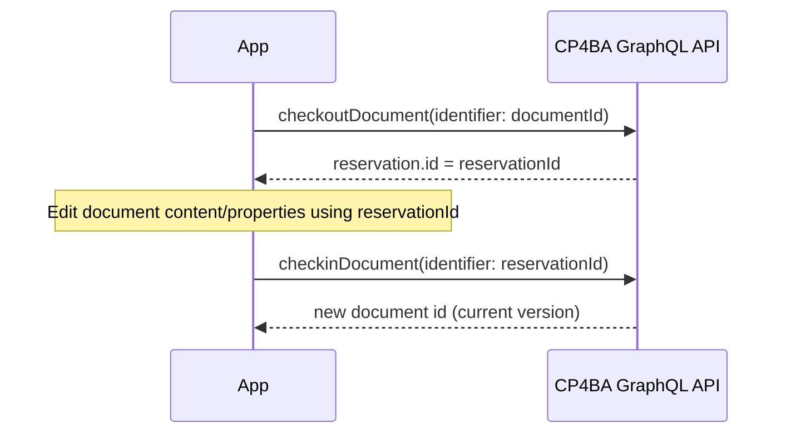

# GraphQL

This document covers the GraphQL integration in the FNCM OpenLiberty Sample: the proxy endpoint that lets the browser send any query, the typed Java operation pattern for server-side processing, the browser editor, and a reference of the most useful sample queries and mutations.

---

## Overview

IBM FileNet Content Manager exposes a modern HTTP-based **Content Services GraphQL API** as part of CP4BA. This application integrates with it in two ways:

1. **Proxy** — The browser sends a GraphQL query to `/api/graphql`. OpenLiberty injects the user's Zen token and forwards the request to `FILENET_GRAPHQL_URL`. No Java code is needed for new queries — the browser writes the query directly.

2. **Typed Java operations** — For server-side logic (e.g. when the backend needs to parse a GraphQL response before returning a result), the application has Java classes implementing `GraphQLOperation`. These are used by specific REST endpoints.

For most new features, use the proxy. Only create a typed Java operation when the server needs to process the response.

---

## The Proxy Endpoint

**Path**: `POST /api/graphql`  
**Auth**: Bearer token required (like all `/api/*` endpoints)  
**Class**: [`GraphQLProxyResource`](../src/main/java/dev/fncm/resource/GraphQLProxyResource.java)

The browser sends a standard GraphQL JSON envelope:

```json
{
  "query": "{ domain { objectStores { objectStores { symbolicName } } } }"
}
```

or with variables:

```json
{
  "query": "query ListFolders($repositoryIdentifier: String!) { folder(repositoryIdentifier: $repositoryIdentifier, identifier: \"/\") { subFolders { folders { name } } } }",
  "variables": { "repositoryIdentifier": "OS1" }
}
```

The resource:
1. Validates the Bearer token (done by `BearerTokenFilter` before the resource is called).
2. Forwards the raw body to `GraphQLService.executeRaw(body, zenToken)`.
3. `GraphQLClient` adds the required `Authorization: Bearer` and `ECM-CS-XSRF-Token` headers.
4. Returns the upstream response body unchanged.

### XSRF Token

The Content Services GraphQL API requires a same-value XSRF token in both a request header (`ECM-CS-XSRF-Token`) and a cookie. `GraphQLClient` generates a random UUID per request and sets both automatically.

---

## Typed Java Operations

For server-side processing, create a class implementing [`GraphQLOperation`](../src/main/java/dev/fncm/service/GraphQLOperation.java):

```java
public interface GraphQLOperation {
    String query();                      // GraphQL query or mutation string
    default Map<String, Object> variables() { return Map.of(); }  // optional
}
```

**Minimum implementation**:

```java
public class ListObjectStoresQuery implements GraphQLOperation {
    @Override
    public String query() {
        return "{ domain { objectStores { objectStores { symbolicName } } } }";
    }
}
```

**With variables**:

```java
public class ListDocumentsInFolderQuery implements GraphQLOperation {
    private final String repositoryId;
    private final String folderPath;

    public ListDocumentsInFolderQuery(String repositoryId, String folderPath) {
        this.repositoryId = repositoryId;
        this.folderPath   = folderPath;
    }

    @Override
    public String query() {
        return """
            query ListDocumentsInFolder($repositoryIdentifier: String!, $folderPath: String!) {
              folder(repositoryIdentifier: $repositoryIdentifier, identifier: $folderPath) {
                containedDocuments { documents { id name } }
              }
            }""";
    }

    @Override
    public Map<String, Object> variables() {
        return Map.of(
            "repositoryIdentifier", repositoryId,
            "folderPath", folderPath
        );
    }
}
```

Call it from a resource via `GraphQLService`:

```java
@Inject GraphQLService graphQLService;

public Response list() {
    return execute(() -> graphQLService.execute(
        new ListDocumentsInFolderQuery(repoId, folderPath),
        tokenContext.getZenToken()
    ));
}
```

See [Adding GraphQL Operations](adding-graphql-operations.md) for a full step-by-step guide.

---

## File Upload (Mutations with Content)

To create a document with file content via GraphQL, use [`FileUploadOperation`](../src/main/java/dev/fncm/service/FileUploadOperation.java) and `GraphQLService.executeMultipart()`:

```java
CreateDocumentMutation mutation = new CreateDocumentMutation(
    repositoryId,       // object store identifier
    folderPath,         // "/TargetFolder"
    "Document",         // document class
    "My Document",      // document name
    additionalProps,    // Map<String, Object> of metadata properties
    fileBytes,          // byte[] file content
    "text/plain",       // MIME type
    "report.md"         // filename
);
String result = graphQLService.executeMultipart(mutation, tokenContext.getZenToken());
```

---

## Browser GraphQL Editor

The **GraphQL Query** card in the UI is an interactive editor that lets you run any GraphQL query or mutation directly against CP4BA.

### How to Use It

1. Log in to the application.
2. Find the **GraphQL Query** card (it appears as a large card in the grid).
3. Select a sample from the **Sample Queries** dropdown — this populates the query editor and any parameter inputs.
4. Edit the query in the text area if needed.
5. Fill in any parameter inputs (e.g. repository identifier, folder path).
6. Click **Run**.
7. The result is rendered as an interactive JSON tree with Tree / Raw toggle.

### Adding Samples to the Dropdown

The sample list is defined in [`js/cards/graphql.js`](../src/main/webapp/js/cards/graphql.js) as `SAMPLE_QUERIES`. Each entry has:

| Property | Description |
|---|---|
| `id` | Unique key |
| `name` | Shown in the dropdown |
| `description` | Shown below the dropdown when selected |
| `params` | Array of `{ id, label, sessionKey?, defaultValue? }` — rendered as input fields |
| `query` | GraphQL query string; use `$paramId` variables matching the param `id` values |

For `params`, setting `sessionKey: 'config.repositoryIdentifier'` automatically pre-fills the input from `session.config.repositoryIdentifier` (set at login). This means users don't need to type the object store name manually.

---

## Sample Query Reference

The following queries and mutations are from [`samples/samples.graphql`](../samples/samples.graphql). They work against any CP4BA object store — replace `OS01` / `OS1` with your actual object store symbolic name.

---

### List Object Stores

Returns the symbolic names of all object stores in the domain.

```graphql
query GetObjectStores {
  domain {
    objectStores {
      objectStores {
        symbolicName
      }
    }
  }
}
```

---

### List Top-Level Folders

Lists all sub-folders of the root folder (`/`) in the given object store.

```graphql
query ListFolders($repositoryIdentifier: String!) {
  folder(
    repositoryIdentifier: $repositoryIdentifier
    identifier: "/"
  ) {
    subFolders {
      folders {
        pathName
        id
        name
      }
    }
  }
}
```

Variables: `{ "repositoryIdentifier": "OS1" }`

---

### List Documents in a Folder

Returns documents contained directly in a folder path.

```graphql
query ListDocumentsInFolder($repositoryIdentifier: String!, $folderPath: String!) {
  folder(
    repositoryIdentifier: $repositoryIdentifier
    identifier: $folderPath
  ) {
    id
    name
    pathName
    containedDocuments {
      documents {
        id
        name
      }
    }
  }
}
```

Variables: `{ "repositoryIdentifier": "OS1", "folderPath": "/MyFolder" }`

---

### Get Document Details

Retrieves metadata and content element information for a single document.

```graphql
query GetDocumentDetails($repositoryIdentifier: String!, $documentId: String!) {
  document(
    repositoryIdentifier: $repositoryIdentifier
    identifier: $documentId
  ) {
    id
    name
    dateCreated
    dateLastModified
    creator
    className
    contentElements {
      ... on ContentTransfer {
        retrievalName
        contentType
        contentSize
        downloadUrl
      }
    }
  }
}
```

Variables: `{ "repositoryIdentifier": "OS1", "documentId": "{GUID}" }`

---

### Search Documents by Class

Searches for documents of a specific class created after a date.

```graphql
query SearchDocumentsByClass($repositoryIdentifier: String!, $className: String!) {
  documents(
    repositoryIdentifier: $repositoryIdentifier
    from: $className
    where: "[DateCreated] > 20180815T070000Z AND [IsCurrentVersion] = True"
  ) {
    documents {
      id
      name
      dateCreated
      className
    }
  }
}
```

Variables: `{ "repositoryIdentifier": "OS1", "className": "Document" }`

---

### Describe a Document Class

Returns all non-system, non-hidden property descriptions for a class, including data types and default values. Useful for building dynamic forms.

```graphql
query DescribeClass($repositoryIdentifier: String!, $className: String!) {
  classDescription(
    repositoryIdentifier: $repositoryIdentifier
    identifier: $className
  ) {
    name
    displayName
    symbolicName
    propertyDescriptions(filter: { isHidden: false }) {
      id
      symbolicName
      displayName
      dataType
      cardinality
      isReadOnly
      isValueRequired
      settability
    }
  }
}
```

Variables: `{ "repositoryIdentifier": "OS1", "className": "Document" }`

---

### Create a Document (no content)

Creates a document with the default class and no content. Useful for quickly creating test records.

```graphql
mutation CreateGenericDocument {
  createDocument(
    repositoryIdentifier: "OS1"
    fileInFolderIdentifier: "/"
    documentProperties: { name: "My Document" }
    checkinAction: {}
  ) {
    id
    name
  }
}
```

---

### Update Document Properties

Updates one or more metadata properties on an existing document.

```graphql
mutation updateDocProperties {
  updateDocument(
    repositoryIdentifier: "OS1"
    identifier: "{DOCUMENT-GUID}"
    documentProperties: {
      properties: [
        { InspectorName: "New Name" }
      ]
    }
  ) {
    name
    id
  }
}
```

---

### Checkout a Document

Checks out a document, creating a reservation. Returns the reservation ID used for checkin.

```graphql
mutation checkoutDocument {
  checkoutDocument(
    repositoryIdentifier: "OS1"
    identifier: "{DOCUMENT-GUID}"
  ) {
    id
    name
    reservation {
      id
      name
      dateCreated
    }
    currentVersion {
      id
      majorVersionNumber
      minorVersionNumber
      versionStatus
    }
  }
}
```

> **Important**: After checkout, use the `reservation.id` (not the original document ID) as the `identifier` for checkin and cancel-checkout operations.

---

### Checkin a Document

Checks in a checked-out document. The `identifier` must be the **reservation ID** returned by checkout.

```graphql
mutation checkinDocument {
  checkinDocument(
    repositoryIdentifier: "OS1"
    identifier: "{RESERVATION-ID}"
    checkinAction: {}
  ) {
    id
  }
}
```

The returned `id` is the ID of the new current version of the document.

---

### Cancel Checkout

Cancels a checkout without creating a new version. The `identifier` must be the **reservation ID**.

```graphql
mutation cancelCheckout {
  cancelDocumentCheckout(
    repositoryIdentifier: "OS1"
    identifier: "{RESERVATION-ID}"
  ) {
    id
  }
}
```

---

### Get User Groups

Returns all security groups in the domain.

```graphql
query GetGroups {
  secGroups(
    realmIdentifier: null
    searchPattern: ""
    searchType: NONE
    searchAttribute: SHORT_NAME
    sortType: ASCENDING
  ) {
    groups {
      id
      shortName
      displayName
      distinguishedName
    }
  }
}
```

---

## Checkout / Checkin Workflow

The document versioning workflow involves three operations:



- The **document ID** is the stable identifier of the document across versions.
- The **reservation ID** is the identifier of the checked-out "work in progress" copy.
- After checkin, the reservation ID no longer exists; a new version ID is created.
- `cancelDocumentCheckout` discards the reservation and leaves the document at its previous version.

---

## Related Documents

- [Backend](backend.md) — GraphQLService, GraphQLOperation interface
- [Adding GraphQL Operations](adding-graphql-operations.md) — step-by-step guide for typed operations
- [Building Inspection Sample](building-inspection-sample.md) — real-world use of GraphQL mutations
